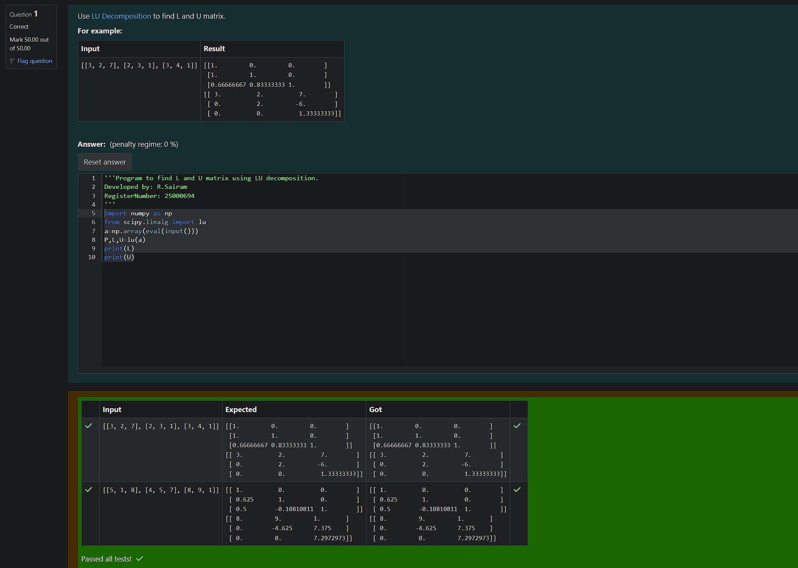
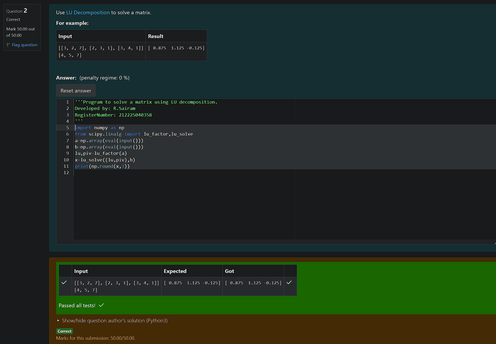

# LU Decomposition 

## AIM:
To write a program to find the LU Decomposition of a matrix.

## Equipments Required:
1. Hardware – PCs
2. Anaconda – Python 3.7 Installation / Moodle-Code Runner

## Algorithm
1. Start the program.
2. Import the necessary libraries such as scipy and numpy.
3. Define matrix numpy.array()
4. Use lu_factor() and lu_solve() to find the solution.

## Program:
(i) To find the L and U matrix
```

Program to find the L and U matrix.
Developed by: R.Sairam
RegisterNumber: 212225040358

```
import numpy as np
from scipy.linalg import lu
a=np.array(eval(input()))
P,L,U=lu(a)
print(L)
print(U)

(ii) To find the LU Decomposition of a matrix
```

Program to find the LU Decomposition of a matrix.
Developed by: R.Sairam
RegisterNumber: 212225040358

```
import numpy as np
from scipy.linalg import lu_factor,lu_solve
a=np.array(eval(input()))
b=np.array(eval(input()))
lu,piv=lu_factor(a)
x=lu_solve((lu,piv),b)
print(np.round(x,3))


## Output:





## Result:
Thus the program to find the LU Decomposition of a matrix is written and verified using python programming.

